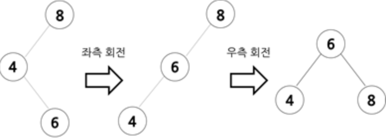

## 트리:회전

### 들어가기 전에
트리에서 불균형이 일어났을 때 회전을 사용하여 해결하는 방법에 대해 알아보자.

### 학습 목표
회전을 사용하여 트리의 불균형을 해결할 수 있다.

### 핵심 단어
- 트리
- 균형
- 회전

---
#### 트리:회전
트리가 한 쪽으로 치우치지 않은 경우에는 우측 회전, 좌측 회전 모두 사용하여 불균형을 해소한다.

- 불균형이 오른쪽 자식의 왼쪽 서브 트리에서 나타날 경우
  
먼저 우측 회전을 한 후 좌측 회전을 하여 균형을 맞춰준다.  

- 불균형이 왼쪽 자식의 오른쪽 서브 트리에서 나타날 경우
  
먼저 좌측 회전을 한 후 우측 회전을 하여 균형을 맞춰준다.
